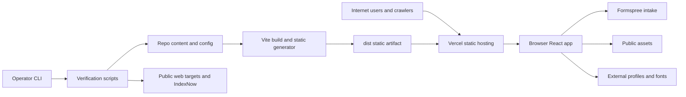

# Portfolio_Site Threat Model

Generated: 2026-07-01

## Executive summary

The highest-risk themes for this repo are public-content integrity, third-party contact-form handling, and crawler/indexation availability. The production app is a Vite/React static site deployed as public Vercel static output, with no repo-visible authentication, server-side application state, or database. The main runtime trust boundary is browser-to-Formspree submission from `src/components/AuditIntakeForm.tsx`; the main integrity boundary is repo content and static-generation code becoming public metadata, JSON-LD, CSV/JSON/PDF assets, sitemap, `llms.txt`, and redirects. Operator-run Node scripts add a separate dev/CI risk surface because they fetch external URLs and submit IndexNow notifications.

## Scope and assumptions

- In scope: this checkout at `/Users/sulaymanbowles/Documents/Codex/Portfolio_Site`, including `src/`, `public/`, `scripts/`, `docs/`, `package.json`, `vite.config.ts`, and `vercel.json`.
- Production/runtime in scope: the public `https://sulayman-bowles.dev` static Vercel deployment, React client routing, static assets, route metadata, JSON-LD, public research files, and the Formspree intake flow.
- CI/build/dev in scope but separated from runtime: Vite dev server, static route generation, link-building validators, Austin benchmark fetcher, external link checker, live checker, and IndexNow submission script.
- Out of scope: Vercel dashboard state, Formspree account configuration, DNS registrar controls, GitHub branch protection settings, analytics dashboards, and private inbox/storage outside this repo.
- User-confirmed context: model public Vercel deployment; treat contact/intake submissions as low-sensitivity data; live Vercel firewall/WAF/bot-protection settings are unknown.
- Open questions that would change risk: whether Formspree has CAPTCHA/spam controls enabled; whether Vercel has custom WAF/rate-limit rules on public HTML and form-related routes; whether deploys require protected-branch review before production.

## System model

### Primary components

- Static React application: `package.json:22-31`, `vite.config.ts:6-29`, `src/main.tsx`, and `src/App.tsx` define a Vite/React client app with lazy-loaded route pages.
- Route and metadata registry: `src/seo/routes.ts:67-430` defines canonical paths, aliases, sitemap inclusion, `noindex`, page type, descriptions, and JSON-LD builders.
- Static route generator: `scripts/generate-static-routes.ts:41-73` builds route-specific heads and JSON-LD, and `scripts/generate-static-routes.ts:247-253` writes static route HTML and sitemap output after Vite build.
- Public source surfaces: `public/robots.txt:1-39`, `public/llms.txt:1-102`, and `public/research/authority-assets.json:1-143` intentionally expose crawler policy, identity/source graph, claim boundaries, research assets, PDFs, CSVs, and JSON.
- Contact/intake UI: `src/components/AuditIntakeForm.tsx:65-105` validates and POSTs JSON to Formspree; `src/pages/ContactPage.tsx:91-93` warns users not to include credentials, unreleased client data, payment details, or production secrets.
- Deployment routing: `vercel.json:1-95` configures Vercel static-build output, clean URLs, canonical host redirects, route aliases, and global security headers.
- Operator scripts: `scripts/check-link-building-live.mjs:93-110`, `scripts/build-austin-crawlability-benchmark.mjs:106-125`, `scripts/check-link-building-external.mjs:81-98`, and `scripts/submit-indexnow.mjs:87-98` perform public network fetches or IndexNow submission from a developer/CI context.

### Data flows and trust boundaries

- Internet users/crawlers -> Vercel static hosting: public HTTP GET/HEAD for HTML, JS, CSS, images, PDFs, CSVs, JSON, `robots.txt`, `llms.txt`, and `sitemap.xml`; TLS is assumed from the public HTTPS deployment; repo-visible controls are redirects in `vercel.json` and crawl directives in `public/robots.txt`; no repo-visible authentication or rate limiting.
- Vercel static hosting -> browser React app: static assets and route HTML execute in the user browser; route normalization and client-side navigation happen in `src/App.tsx:173-179` and `src/hooks/usePageTransitions.ts:169-215`; same-origin links are intercepted, external links and file-like paths are not.
- Browser React app -> Formspree: contact fields cross from untrusted browser input to a third-party endpoint over HTTPS as JSON; client-side checks require email and message and use input types for email and URL, but spam/rate limiting/storage guarantees depend on Formspree account controls not visible in repo.
- Repo content/config -> Vite/static generator -> `dist/`: developer-controlled source content becomes public HTML, metadata, JSON-LD, sitemap, and static fallback content; `scripts/generate-static-routes.ts:11-21` escapes HTML/JSON contexts and `src/utils/seo.ts:37-54` escapes `<` in client-inserted JSON-LD.
- Operator CLI -> public web targets and IndexNow: developer-run scripts fetch external sites, raw GitHub README URLs, live deployment URLs, and IndexNow; these are not reachable by remote site visitors unless an operator runs the scripts.
- Public static files -> external crawlers and AI/search systems: `public/robots.txt` and `public/llms.txt` intentionally invite public discovery; availability and interpretation depend on crawlers and any live Vercel bot/firewall controls.

#### Diagram

## Assets and security objectives

| Asset | Why it matters | Security objective (C/I/A) |
| --- | --- | --- |
| Public identity/source graph | Drives search, AI retrieval, personal identity reconciliation, and external profile consistency. | Integrity, availability |
| Public research assets and claim boundaries | CSV/JSON/PDF assets are intended as citation-ready evidence; misleading or stale assets can create reputational or business harm. | Integrity, availability |
| Contact/intake submissions | Low-sensitivity names, emails, site URLs, and project notes; users are warned not to submit secrets or private client data. | Confidentiality, integrity, availability |
| Formspree endpoint/account | Receives and stores submissions outside repo control. | Confidentiality, availability |
| Static build artifact and route metadata | Production output controls what crawlers and users see. | Integrity, availability |
| Domain canonicalization and crawl files | `robots.txt`, `sitemap.xml`, redirects, and `llms.txt` determine discoverability and stale URL cleanup. | Integrity, availability |
| Operator machine/CI network context | Node scripts perform outbound fetches and could be abused if script inputs are manipulated. | Confidentiality, availability |
| Dependency and dev-server surface | Vite/dev tooling can expose source or local files if run unsafely; production output is static. | Confidentiality, integrity |

## Attacker model

### Capabilities

- Remote unauthenticated users can browse all public routes and static assets.
- Remote users can submit arbitrary low-sensitivity contact-form content to the Formspree endpoint from the public browser app.
- Crawlers, scrapers, and bots can request public pages, `robots.txt`, `llms.txt`, sitemap, PDFs, CSVs, and JSON assets.
- An attacker who can influence repo content, docs CSVs, or operator command arguments can affect generated public output or developer-run fetch scripts.
- A network-local attacker should not reach the default Vite dev server because `package.json:7` binds it to `127.0.0.1`; exposure risk returns if an operator overrides the host or runs a different server command.

### Non-capabilities

- No repo-visible authenticated user roles, sessions, admin panel, database, API server, or multi-tenant runtime state exist in this codebase.
- Remote visitors cannot directly execute `scripts/*.mjs` or `scripts/*.ts`; those are operator-run build/verification tools.
- Remote visitors cannot access Vercel firewall settings, Formspree inbox settings, GitHub branch protections, or DNS controls from this repo alone.
- Form submissions are confirmed low sensitivity, so the model does not treat normal inquiry leakage as high-impact regulated-data exposure.

## Entry points and attack surfaces

| Surface | How reached | Trust boundary | Notes | Evidence (repo path / symbol) |
| --- | --- | --- | --- | --- |
| Public route HTML | Internet GET/HEAD to canonical routes and aliases | Internet -> Vercel static hosting | Static public content, metadata, and JSON-LD. | `README.md:9-31`, `src/seo/routes.ts:67-430`, `vercel.json:13-95` |
| React client routing | Browser clicks same-origin links or loads paths directly | Browser URL -> client app state | Normalizes aliases and intercepts same-origin navigation. | `src/App.tsx:173-179`, `src/hooks/usePageTransitions.ts:169-215` |
| Contact/intake form | Public `/contact` and homepage brief form | Browser input -> Formspree | Sends name, email, website URL, selects, textareas, and message as JSON after honeypot and obvious-secret checks. | `src/components/AuditIntakeForm.tsx:65-105`, `src/pages/ContactPage.tsx:91-93` |
| Public static files | Direct GET to `/research/*`, resume PDF, `llms.txt`, `robots.txt`, sitemap | Internet -> static assets | Intended public downloads and crawler source files. | `README.md:64-70`, `public/llms.txt:46-69`, `public/research/authority-assets.json:1-143` |
| JSON-LD/head injection | Build-time generated route heads and client `useSEO` | Repo content -> HTML/DOM | Existing code escapes HTML and `<` in JSON-LD. | `scripts/generate-static-routes.ts:11-21`, `scripts/generate-static-routes.ts:50-73`, `src/utils/seo.ts:37-54` |
| Vercel redirects and headers | Requests to www host, legacy aliases, and public routes | Internet -> deployment routing | Canonical host/path migrations plus global browser security headers. | `vercel.json:13-95` |
| Crawler policy | Crawler requests to `robots.txt`, `llms.txt`, sitemap | Crawlers -> public source files | Broad crawler allowance and AI/search access are intentional. | `public/robots.txt:1-39`, `public/llms.txt:60-79` |
| Operator network fetch scripts | `npm run benchmark:austin`, live/external checks, IndexNow | Operator machine/CI -> external URLs | Not runtime-reachable, but relevant to developer/CI security. | `package.json:13-20`, `scripts/build-austin-crawlability-benchmark.mjs:106-125`, `scripts/check-link-building-live.mjs:93-110`, `scripts/submit-indexnow.mjs:87-98` |
| Dev server | `npm run dev` | Local browser -> Vite dev server | Binds to loopback by default; dev-only and should not run long-lived in synced Documents path. | `package.json:7`, `vite.config.ts:14-17` |

## Top abuse paths

1. Attacker goal: spam or poison intake. Steps: discover Formspree endpoint in shipped JS -> submit repeated fake audit requests -> consume inbox quota or bury real inquiries. Impact: contact availability and workflow integrity degradation.
2. Attacker goal: trick a user into oversharing. Steps: use public intake page framing -> submit private client details despite warning -> data leaves site boundary into Formspree. Impact: low-to-moderate confidentiality impact if users ignore guidance.
3. Attacker goal: corrupt public identity/source graph. Steps: compromise repo, branch, or deploy workflow -> alter `src/seo/routes.ts`, `public/llms.txt`, or public research JSON -> deploy false canonical claims. Impact: search/AI identity poisoning and reputational harm.
4. Attacker goal: turn static content into XSS. Steps: introduce untrusted HTML into route/static content sources -> bypass or remove escaping in static generation or JSON-LD insertion -> execute script in visitor browser. Impact: browser compromise within site origin.
5. Attacker goal: block public discovery. Steps: trigger or misconfigure Vercel firewall/bot rules -> challenge or deny bots and audit agents on public HTML, sitemap, or source pages -> reduce crawlability and stale URL correction. Impact: availability loss for search/AI/audit workflows.
6. Attacker goal: abuse operator scripts. Steps: modify benchmark/outreach CSVs or pass hostile URLs -> cause developer/CI to fetch internal, slow, or abusive endpoints -> leak network metadata or waste operator resources. Impact: developer/CI confidentiality and availability risk.
7. Attacker goal: expose local source through dev tooling. Steps: wait for an operator to override the default loopback dev host or run another network-bound preview during local development -> exploit dev-server/path traversal class bugs or misconfiguration -> read source/local files. Impact: developer-machine confidentiality risk; not production runtime.

## Threat model table

| Threat ID | Threat source | Prerequisites | Threat action | Impact | Impacted assets | Existing controls (evidence) | Gaps | Recommended mitigations | Detection ideas | Likelihood | Impact severity | Priority |
| --- | --- | --- | --- | --- | --- | --- | --- | --- | --- | --- | --- | --- |
| TM-001 | Remote unauthenticated form submitter | Public JS exposes the Formspree destination; attacker can automate POSTs. | Spam, quota abuse, or content poisoning through the intake form. | Real inquiries can be buried; operator time wasted. | Contact/intake submissions, Formspree endpoint availability. | Client requires email and message before submit in `AuditIntakeForm.tsx:65-68`; a hidden honeypot short-circuits bot submissions in `AuditIntakeForm.tsx:70-74`; users are warned not to submit sensitive details in `ContactPage.tsx:91-93`. | Repo does not show CAPTCHA, server-side validation, rate limits, or Formspree spam controls. | Enable Formspree spam/CAPTCHA controls if spam appears; rate-limit at Vercel/Formspree where possible; keep direct email fallback. | Monitor Formspree submission volume, bounce/error rate, repeated sender domains, and time-window spikes. | Medium because public forms are routinely scraped. | Low to medium because user confirmed low-sensitivity form data. | Medium |
| TM-002 | Remote user who convinces submitter to overshare, or careless submitter | User ignores the public warning and submits private credentials, private client data, payment details, or production secrets. | Sensitive data leaves the browser into third-party Formspree storage. | Confidentiality exposure outside repo-controlled systems. | Intake submissions, Formspree account, user/client data. | Explicit warning in `ContactPage.tsx:91-93`; form fields are business inquiry oriented; obvious key/password/token patterns are blocked before POST in `AuditIntakeForm.tsx:11-16` and `AuditIntakeForm.tsx:76-80`. | Client-side pattern checks are bypassable and Formspree retention/access controls are unknown. | Keep the inline warning near the form; document Formspree retention/access settings; treat client-side blocking as UX guardrail, not a security boundary. | Alert on high-entropy strings or obvious secret keywords if Formspree workflow supports automation; manually triage suspicious submissions. | Low to medium because warning exists but humans may ignore it. | Medium if a user submits real secrets, though normal data is low sensitivity. | Medium |
| TM-003 | Malicious committer, compromised dependency, or future untrusted content source | Attacker can alter repo content, generated route metadata, public assets, or build output before deploy. | Publish false identity, source-graph, research, or claim-boundary data. | Search/AI retrieval poisoning, reputational harm, false outreach evidence, stale or misleading public claims. | Public identity/source graph, research assets, route metadata, sitemap, `llms.txt`. | Source of truth is centralized in `src/seo/routes.ts:67-430`; public claim boundaries are explicit in `public/llms.txt:95-102` and `public/research/authority-assets.json:5-10`; verification scripts exist in `package.json:16-20`. | Repo does not show branch protection, mandatory review, artifact signing, or deploy provenance checks. | Protect production branch; require review for `src/seo`, `public/`, `scripts/generate-static-routes.ts`, and `vercel.json`; run `npm run lint`, `npm run build`, and `npm run verify:seo` before deploy; diff generated `dist` in release workflow if used. | Monitor live `llms.txt`, sitemap, canonical pages, and authority asset JSON for unexpected changes; alert on changed canonical host or source graph fields. | Low to medium because it requires repo/deploy influence. | High because integrity is the main security objective of this public identity site. | High |
| TM-004 | Remote web attacker or future content pipeline | Future route content becomes untrusted, or existing escaping is weakened. | Inject HTML/script through static fallback content, metadata, JSON-LD, or direct DOM insertion. | Visitor browser execution in site origin; could alter public content, steal form data before submit, or redirect users. | Browser users, contact form data, public trust. | Static generator escapes HTML in `scripts/generate-static-routes.ts:11-21`; JSON-LD escapes `<` in `src/utils/seo.ts:37-54`; global Vercel headers set CSP, HSTS, nosniff, frame denial, referrer policy, and permissions policy in `vercel.json`; current `innerHTML` use is numeric generated tooltip content in `src/components/CandlestickChart.tsx:196-211`. | CSP has no report endpoint, and future externalized content may bypass React escaping if inserted into templates. | Keep Vercel `headers` covered by `npm run verify:security`; consider CSP reporting before tightening further; keep all content generation through escaping helpers; replace tooltip `innerHTML` with DOM/text nodes or React state for defense in depth. | Browser CSP reports if enabled; static grep for `innerHTML`, `dangerouslySetInnerHTML`, raw template interpolation, and JSON-LD script insertion. | Low for current repo-controlled content. | High if exploitability appears, because form and identity pages share origin. | Medium |
| TM-005 | Vercel firewall/bot rules, bot traffic, or misconfigured anti-abuse controls | Live Vercel controls are unknown; public content intentionally targets crawlers and audit agents. | Challenge, deny, or rate-limit public HTML, sitemap, `robots.txt`, `llms.txt`, or source pages. | Public discovery, AI/search retrieval, IndexNow validation, and audit tooling degrade or see checkpoint pages. | Crawlability, public source graph availability, route metadata availability. | `public/robots.txt:1-39` explicitly allows search and AI crawlers; `docs/vercel-security-checkpoint-ai-access.md:46-65` recommends keeping public content fetchable and using narrow controls. | Firewall state is outside repo and unknown; no repo-level automated live check covers all crawler user agents. | Verify Vercel Firewall event logs; keep public GET/HEAD routes in log or narrow bypass for trusted agents; keep stricter rules only for POST, admin, or abuse-prone endpoints; run live checks after rule changes. | Track 403/challenge rates by route and user agent; run `npm run linkbuilding:live-check` and crawler-specific probes after deployment. | Medium because prior notes indicate checkpoint behavior can occur. | Medium because it affects availability and public evidence, not private data. | Medium |
| TM-006 | Malicious commit to docs CSVs or operator-supplied script arguments | Operator or CI runs external fetch scripts on attacker-influenced URLs. | Force scripts to fetch internal, slow, very large, or abusive URLs. | Developer/CI network metadata disclosure, resource consumption, bad measurement data, or accidental traffic to sensitive hosts. | Operator machine/CI availability, benchmark integrity, external-check integrity. | Fetch scripts set user agents and timeouts in `build-austin-crawlability-benchmark.mjs:106-125`; IndexNow validates submitted host in `submit-indexnow.mjs:19-26`. | Benchmark/external-check URLs are not allowlisted to public HTTP(S) hostnames; scripts do not reject private IP ranges after DNS resolution. | Add URL validation for protocol, hostname, and private/reserved IP ranges; cap response size; keep timeouts; separate public benchmark inputs from trusted release scripts. | Log final URLs, status, byte counts, and private IP rejections; review changed CSV inputs before running scripts in CI. | Low to medium because scripts are operator-run, not remote runtime. | Medium for developer/CI boundary. | Medium |
| TM-007 | Network-local attacker against developer machine | Developer overrides the loopback default, runs a different preview server on an exposed network, or leaves dev tooling running in a dirty iCloud-synced checkout. | Access dev server, exploit dev-server advisory class, or observe source/dev assets. | Local source exposure or developer-machine risk; no production customer data. | Source code, local development environment. | Dev server is a script, not production config; `package.json:7` shows `--host=127.0.0.1`; `vite.config.ts:14-17` controls HMR/watch; package metadata pins Vite to the patched `^6.4.3` line. | Risk remains if an operator overrides the host, runs a separate network-bound server, or leaves stale local dependencies installed. | Keep localhost-only dev by default; use temporary explicit host only when needed; run a fresh install in a non-synced workspace before release validation; avoid long-lived dev servers in `/Users/sulaymanbowles/Documents/Codex`. | Check active listeners before/after frontend previews; periodically run `npm audit` and dependency update review. | Low in normal local use. | Medium if exposed on an untrusted network. | Low |
| TM-008 | Accidental publisher or malicious committer | Private file is placed under `public/` or linked from route/static content. | Publish private resume variants, client data, internal notes, or non-public research artifacts as static assets. | Public data exposure and reputational harm. | Public assets, PDFs, CSVs, source graph, research files. | Public asset boundaries are documented in `public/llms.txt:46-58` and `public/research/authority-assets.json:5-10`; no secret-like files were found in a targeted file-name scan during this audit. | No pre-commit rule blocks sensitive file names, large private docs, or accidental `public/` additions. | Add a pre-publish manifest check for `public/`; scan for secret-like patterns and private/client keywords before deploy; keep `docs/link-building/publish-manifest.json` aligned with intended public files. | Alert on new `public/` files in PRs; run secret scanning and public-file inventory diffs before deploy. | Medium because static sites commonly leak by misplaced files. | Medium even with low form sensitivity, because public PDFs/CSVs can contain unintended data. | Medium |

## Criticality calibration

- Critical: pre-auth remote code execution in a production server, production credential theft, domain/DNS takeover, or deploy pipeline compromise that silently publishes attacker-controlled identity pages. Current repo evidence does not show a production server or auth system, so no critical threats were assigned.
- High: compromise of public identity/source graph or production static artifact integrity; broad XSS on canonical pages; unauthorized production deployment that alters route metadata, `llms.txt`, sitemap, or public research assets. TM-003 is high because integrity is the central asset of this site.
- Medium: contact-form spam or accidental oversharing into Formspree; future XSS paths if escaping or CSP coverage regresses; crawler/firewall misconfiguration that blocks public source pages; operator-run scripts fetching hostile URLs; accidental public-file disclosure. TM-001, TM-002, TM-004, TM-005, TM-006, and TM-008 fall here.
- Low: dev-only exposure requiring local network access, issues limited to low-sensitivity public data, or attacks requiring unlikely operator mistakes with easy recovery. TM-007 is low under normal local-only development assumptions.

## Focus paths for security review

| Path | Why it matters | Related Threat IDs |
| --- | --- | --- |
| `src/components/AuditIntakeForm.tsx` | Public Formspree boundary and client-side validation for contact data. | TM-001, TM-002, TM-004 |
| `src/pages/ContactPage.tsx` | User-facing guidance about what not to submit and links around the intake path. | TM-001, TM-002 |
| `src/hooks/usePageTransitions.ts` | Same-origin navigation interception and URL normalization behavior. | TM-004 |
| `src/App.tsx` | Runtime route dispatch, lazy route loading, and canonical path replacement. | TM-003, TM-004 |
| `src/seo/routes.ts` | Source of truth for route exposure, aliases, sitemap inclusion, noindex, and metadata. | TM-003, TM-005 |
| `src/seo/staticContent.ts` | Build-time fallback HTML generation and HTML interpolation. | TM-003, TM-004, TM-008 |
| `src/utils/seo.ts` | Client-side JSON-LD and metadata insertion into the document head. | TM-004 |
| `scripts/generate-static-routes.ts` | Converts repo content into production route HTML, sitemap, JSON-LD, and static fallbacks. | TM-003, TM-004 |
| `vercel.json` | Deployment redirects and the best repo-local place to add security headers. | TM-003, TM-004, TM-005 |
| `public/robots.txt` | Public crawler policy and broad bot allowance. | TM-005 |
| `public/llms.txt` | Canonical public source file for identity, crawler signals, source roles, and claim boundaries. | TM-003, TM-005, TM-008 |
| `public/research/authority-assets.json` | Public JSON source of citation assets and claim boundaries. | TM-003, TM-008 |
| `scripts/submit-indexnow.mjs` | Operator-run submission path with host validation and public key proof. | TM-006 |
| `scripts/build-austin-crawlability-benchmark.mjs` | Operator-run external fetcher over CSV-controlled target URLs. | TM-006 |
| `scripts/check-link-building-external.mjs` | Operator-run external fetcher over outreach outcome URLs. | TM-006 |
| `scripts/check-link-building-live.mjs` | Live verification of public deployment availability and source surfaces. | TM-005, TM-008 |
| `package.json` | Defines dev server host binding, build pipeline, and verification scripts. | TM-006, TM-007 |
| `vite.config.ts` | Dev server HMR/watch behavior and build chunking. | TM-007 |
| `docs/vercel-security-checkpoint-ai-access.md` | Documents deployment-layer bot/firewall risks not visible in source. | TM-005 |

## Quality check

- Covered discovered entry points: public routes/assets, client routing, contact form, static generation, Vercel redirects, crawler files, operator fetch scripts, and dev server.
- Covered each trust boundary in at least one threat: Internet/Vercel, browser/Formspree, repo/build artifact, crawler/public files, operator scripts/external web, and local dev server.
- Separated production/runtime from CI/build/dev tooling: Formspree, static routes, and public assets are runtime; Node fetch scripts and Vite dev server are operator/dev surfaces.
- Reflected user clarifications: public Vercel deployment, low-sensitivity form data, and unknown live Vercel controls.
- Kept assumptions explicit: no repo-visible auth, database, server API, branch protection, Formspree account controls, Vercel firewall state, or DNS/account configuration.
